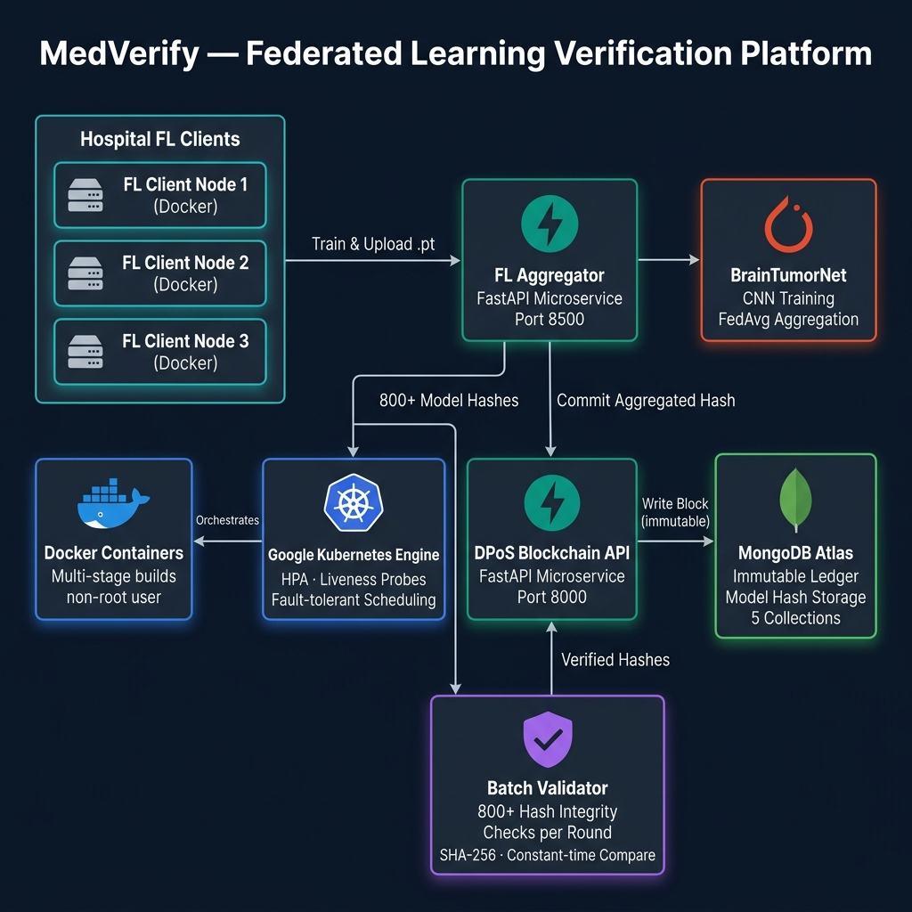
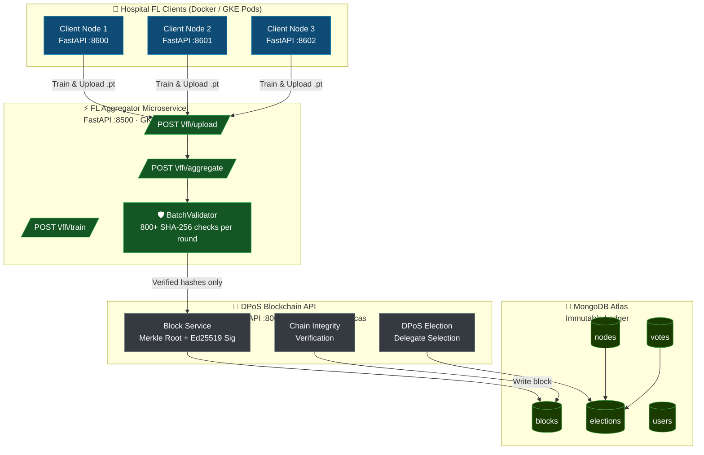

<div align="center">

# 🏥 MedVerify

### Federated Learning Verification Platform on Google Kubernetes Engine

[](https://fastapi.tiangolo.com/)
[](https://python.org)
[](https://pytorch.org)
[](https://mongodb.com)
[](https://docker.com)
[](https://cloud.google.com/kubernetes-engine)
[](Jenkinsfile)
[](LICENSE)

</div>

---

MedVerify is a **distributed federated learning infrastructure** for training and verifying medical AI models (Brain Tumor MRI classification) across hospital nodes — without ever sharing raw patient data. Model integrity is cryptographically enforced via a custom **Delegated Proof of Stake (DPoS) blockchain** backed by MongoDB, with all model update hashes stored in an immutable on-chain ledger.

The system is containerized with **Docker** and deployed on **Google Kubernetes Engine (GKE)** with horizontal autoscaling and fault-tolerant scheduling.

---

## Architecture





---

## Key Features

| Feature | Details |
|---|---|
| **FastAPI Microservices** | Two independent services: DPoS Blockchain API (`:8000`) + FL Aggregator (`:8500`) |
| **GKE Deployment** | Kubernetes manifests in `k8s/` with HPA (2–10 replicas), liveness & readiness probes |
| **Docker** | Multi-stage builds, non-root user, healthchecks for both services |
| **Federated Learning** | BrainTumorNet CNN trained locally at each hospital node; FedAvg aggregation |
| **DPoS Consensus** | Delegated Proof of Stake election, Ed25519 signing, Merkle root per block |
| **Batch Integrity Validation** | 800+ model update hashes verified per training round via SHA-256 re-computation |
| **Immutable MongoDB Ledger** | Model hashes, block signatures and chain linkage persisted in MongoDB with TTL indexes |
| **JWT Auth** | Access + refresh token flow, per-user session limits, TTL-indexed token store |

---

## Repository Structure

```
med-verify/
├── backend/                  # DPoS Blockchain API (FastAPI)
│   ├── Dockerfile            # Multi-stage, non-root
│   ├── main.py               # App factory + background scheduler
│   ├── config/               # DB, logging config
│   ├── model/                # Pydantic models (Block, Node, Vote…)
│   ├── services/             # block_service, dpos_service, node_service
│   ├── security/             # JWT auth, token management
│   ├── utils/                # Crypto, hash, validation utilities
│   └── web/rest/             # FastAPI routers
│
├── fl_backend/               # Federated Learning Microservice (FastAPI)
│   ├── Dockerfile            # Multi-stage, GPU-compatible
│   ├── main.py               # App factory
│   ├── core/
│   │   ├── fl_service.py     # Train / Upload / Aggregate endpoints
│   │   ├── batch_validator.py# 800+ model hash integrity checker ← KEY FILE
│   │   ├── config.py         # FL env config
│   │   └── utils.py          # SHA-256 hashing, logging helpers
│   ├── clients/              # Local training (BrainTumorNet, FedAvg dataset split)
│   └── server/               # Aggregator, blockchain client
│
├── k8s/                      # Kubernetes / GKE manifests
│   ├── namespace.yaml
│   ├── configmap.yaml
│   ├── secrets.yaml          # Template — fill before deploying
│   ├── mongodb-deployment.yaml
│   ├── backend-deployment.yaml
│   ├── fl-backend-deployment.yaml
│   └── hpa.yaml              # HorizontalPodAutoscaler (CPU + memory)
│
├── docker-compose.yml        # Local multi-service orchestration
├── round_run.py              # Automated FL round orchestrator (Election → Train → Aggregate)
└── docs/
    └── architecture.png      # System architecture diagram
```

---

## Quick Start

### Prerequisites

- Docker 24+ and Docker Compose v2
- Python 3.11 (for local dev without Docker)
- MongoDB 7.0 (or use the Docker Compose stack)

### 1 — Clone & configure

```bash
git clone https://github.com/Vr978/med-verify.git
cd med-verify

# Copy and fill in env secrets
cp backend/.env.example backend/.env
# Edit backend/.env: set MONGO_PASSWORD, JWT_SECRET, etc.
```

### 2 — Run locally with Docker Compose

```bash
docker compose up --build
```

Services start on:
- **DPoS Blockchain API** → http://localhost:8000/docs
- **FL Aggregator** → http://localhost:8500/docs
- **MongoDB** → localhost:27017

### 3 — Run an FL round

```bash
# In a separate terminal (after compose is up)
python round_run.py
```

This will: elect delegates → trigger training on each client → poll until done → upload models → batch-validate 800+ hashes → aggregate via FedAvg → commit block to blockchain.

---

## Deploying to GKE

### Prerequisites

- `gcloud` CLI authenticated to your GCP project
- `kubectl` configured for your GKE cluster
- Docker images pushed to GCR

```bash
# 1. Build & push images
export PROJECT_ID=your-gcp-project-id

docker build -t gcr.io/$PROJECT_ID/medverify-backend:latest ./backend
docker build -t gcr.io/$PROJECT_ID/medverify-fl-backend:latest ./fl_backend
docker push gcr.io/$PROJECT_ID/medverify-backend:latest
docker push gcr.io/$PROJECT_ID/medverify-fl-backend:latest

# 2. Update image references in k8s/*.yaml
sed -i "s/YOUR_GCP_PROJECT/$PROJECT_ID/g" k8s/backend-deployment.yaml k8s/fl-backend-deployment.yaml

# 3. Populate secrets (see k8s/secrets.yaml template)
# Never commit real values — use GCP Secret Manager in production

# 4. Apply manifests
kubectl apply -f k8s/namespace.yaml
kubectl apply -f k8s/configmap.yaml
kubectl apply -f k8s/secrets.yaml
kubectl apply -f k8s/mongodb-deployment.yaml
kubectl apply -f k8s/backend-deployment.yaml
kubectl apply -f k8s/fl-backend-deployment.yaml
kubectl apply -f k8s/hpa.yaml

# 5. Verify
kubectl get pods -n medverify
kubectl get hpa -n medverify
```

The HPA automatically scales the FL backend from **2 to 10 pods** based on CPU utilisation — distributing model validation and aggregation across GKE compute nodes.

---

## How the Integrity Verification Works

```
Training Round (per hospital node)
    │
    ▼
Local BrainTumorNet training (PyTorch, FedAvg split)
    │
    ▼ SHA-256(model.pt) ──────────────────────────────────────────┐
    │                                                              │
    ▼                                                    Client submits hash
FL Aggregator receives model upload                               │
    │                                                              │
    ▼                                                              │
BatchValidator.validate(paths, expected_hashes)  ◄────────────────┘
    │   • re-computes SHA-256 from bytes on disk
    │   • constant-time comparison (HMAC-safe)
    │   • quarantines mismatches
    ▼
FedAvg aggregation on validated models only
    │
    ▼
DPoS Blockchain API: add_block()
    │   • Verifies delegate is elected for current round
    │   • Derives & checks Ed25519 public key ownership
    │   • Computes Merkle root of all model hashes
    │   • Signs block with delegate private key
    │   • Chains to previous block hash
    ▼
MongoDB (immutable — no DELETE, no UPDATE on blocks collection)
```

---

## DPoS Consensus

Delegates are elected each round via the `/dpos/elect` endpoint. Each elected hospital node:

1. Trains a local model partition
2. Submits model hash to the blockchain API
3. The lead delegate aggregates and signs the block

A background scheduler (APScheduler, every 2 min) auto-expires rounds. All blocks are verifiable via `/blocks/verify-chain`.

---

## Tech Stack

| Layer | Technology |
|---|---|
| API Framework | FastAPI 0.115 + Uvicorn |
| ML Training | PyTorch 2.4, BrainTumorNet CNN |
| Dataset | Brain Tumor MRI (HuggingFace `Hemg/Brain-Tumor-MRI-Dataset`) |
| Consensus | Custom DPoS — Ed25519 signing, Merkle tree |
| Database | MongoDB 7.0 (Motor async driver) |
| Containerization | Docker (multi-stage, non-root) |
| Orchestration | Google Kubernetes Engine, HPA, PVC |
| Auth | JWT (access + refresh), bcrypt, PyNaCl |
| Hashing | SHA-256 (hashlib), HMAC constant-time compare |

---

## CI/CD — Jenkins Pipeline

The [`Jenkinsfile`](Jenkinsfile) at the repo root defines a **declarative Jenkins pipeline** that fully automates the build, test, and deploy cycle to GKE.

```
Push to main
    │
    ▼
1. Checkout          — clone repo, log branch + commit SHA
2. Lint & Validate   — kubectl apply --dry-run=client on all k8s/ manifests
3. Test              — run BatchValidator SHA-256 self-test (gates the build)
4. Build Images      — parallel docker build for backend + fl_backend (multi-stage)
5. Push to GCR       — push :BUILD_NUMBER-SHA and :latest tags to Google Container Registry
6. Deploy to GKE     — kubectl set image for rolling zero-downtime update
7. Verify Rollout    — kubectl rollout status (180s timeout) + pod/HPA status report
```

**Key Jenkins credentials required** (set in Manage Jenkins → Credentials):

| Credential ID | Type | Purpose |
|---|---|---|
| `GCP_SA_KEY` | Secret File | GCP service account JSON for `gcloud` auth |
| `GCP_PROJECT_ID` | Secret Text | GCP project for GCR image paths |
| `GKE_CLUSTER_NAME` | Secret Text | Target GKE cluster name |
| `GKE_ZONE` | Secret Text | GKE zone (e.g. `us-central1-a`) |

The pipeline is **branch-aware** — image push and GKE deploy only run on `main` or version tags (`v*.*.*`), so feature branches only run lint + test + build.

---

## License

MIT — see [LICENSE](LICENSE).
