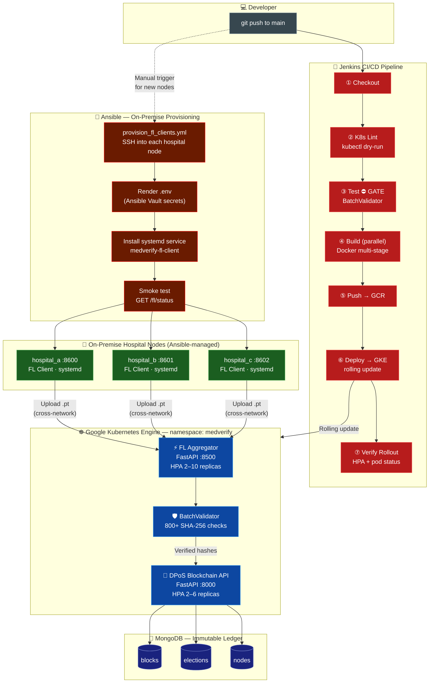
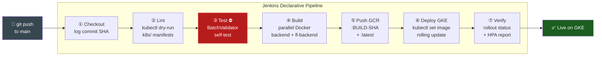

<div align="center">

# 🏥 MedVerify

### Federated Learning Verification Platform on Google Kubernetes Engine

[](https://fastapi.tiangolo.com/)
[](https://python.org)
[](https://pytorch.org)
[](https://mongodb.com)
[](https://docker.com)
[](https://cloud.google.com/kubernetes-engine)
[](Jenkinsfile)
[](ansible/)
[](LICENSE)

</div>

---

MedVerify is a **distributed federated learning infrastructure** for training and verifying medical AI models (Brain Tumor MRI classification) across hospital nodes — without ever sharing raw patient data. Model integrity is cryptographically enforced via a custom **Delegated Proof of Stake (DPoS) blockchain** backed by MongoDB, with all model update hashes stored in an immutable on-chain ledger.

The system is containerized with **Docker**, deployed on **Google Kubernetes Engine (GKE)** with horizontal autoscaling, shipped via a **Jenkins CI/CD pipeline**, and the on-premise hospital nodes are provisioned and configured with **Ansible** — addressing the real-world constraint that hospitals with data residency regulations cannot push compute into the cloud.

---

## System Architecture




---

## Key Features

| Feature | Details |
|---|---|
| **FastAPI Microservices** | Two independent services: DPoS Blockchain API (`:8000`) + FL Aggregator (`:8500`) |
| **GKE Deployment** | Kubernetes manifests in `k8s/` with HPA (2–10 replicas), liveness & readiness probes |
| **Docker** | Multi-stage builds, non-root user, healthchecks; built in parallel by Jenkins |
| **Jenkins CI/CD** | 7-stage declarative pipeline: lint → test → parallel build → GCR push → GKE rolling deploy |
| **Ansible Provisioning** | Idempotent playbook provisions on-premise hospital nodes that cannot run in GKE (data residency) |
| **Federated Learning** | BrainTumorNet CNN trained locally at each hospital node; FedAvg aggregation |
| **DPoS Consensus** | Delegated Proof of Stake election, Ed25519 signing, Merkle root per block |
| **Batch Integrity Validation** | 800+ model hashes verified per round via SHA-256; self-test **gates the Jenkins pipeline** |
| **Immutable MongoDB Ledger** | Model hashes, block signatures and chain linkage persisted with TTL indexes |
| **JWT Auth** | Access + refresh token flow, per-user session limits, TTL-indexed token store |

---

## Why Ansible? (Design Decision)

In a real federated medical AI deployment, **not all compute can live in the cloud**:

- 🏛️ HIPAA / data-residency laws may require model training to stay within a hospital's physical network
- 🔒 Air-gapped hospital networks don't allow outbound connections to GKE
- 🖥️ Existing bare-metal GPU servers are already in the hospital — reusing them is cheaper than cloud

**Kubernetes manages the cloud-hosted aggregation and blockchain API. Ansible manages the on-premise hospital training nodes.** The two tools are complementary, not competing — each operating in the layer it's best suited for.

| Concern | Handled by |
|---|---|
| Cloud microservice orchestration | Kubernetes / GKE |
| CI/CD pipeline automation | Jenkins |
| On-premise node configuration | **Ansible** |
| Secret injection to hospital nodes | **Ansible Vault** |
| Auto-restart on crash (on-prem) | **systemd** (configured by Ansible) |

---

## Repository Structure

```
med-verify/
├── Jenkinsfile                    # ← CI/CD pipeline (7 stages, gated)
│
├── ansible/                       # ← On-premise hospital node provisioning
│   ├── ansible.cfg                # Project-level Ansible config (SSH pipelining)
│   ├── inventory.ini              # Hospital node IPs, ports, node_ids
│   └── playbooks/
│       ├── provision_fl_clients.yml   # Main playbook — runs 8 tasks + smoke test
│       └── templates/
│           ├── fl_client.env.j2       # .env template (secrets via Ansible Vault)
│           └── fl_client.service.j2   # systemd unit (auto-restart, resource caps)
│
├── backend/                       # DPoS Blockchain API (FastAPI, GKE)
│   ├── Dockerfile                 # Multi-stage — built by Jenkins Stage 4
│   ├── main.py                    # App factory + background scheduler
│   ├── services/                  # block_service, dpos_service, node_service
│   ├── security/                  # JWT auth, token management
│   └── utils/                     # Crypto (Ed25519), hash, validation
│
├── fl_backend/                    # FL Aggregator Microservice (FastAPI, GKE)
│   ├── Dockerfile                 # Multi-stage — built by Jenkins Stage 4
│   ├── core/
│   │   ├── fl_service.py          # Train / Upload / Aggregate endpoints
│   │   ├── batch_validator.py     # 800+ SHA-256 checks — Jenkins Stage 3 gate
│   │   └── utils.py               # Hashing, logging helpers
│   ├── clients/                   # BrainTumorNet, FedAvg dataset split
│   └── server/                    # Aggregator, blockchain client
│
├── k8s/                           # GKE manifests — dry-run in Jenkins Stage 2
│   ├── namespace.yaml
│   ├── configmap.yaml
│   ├── secrets.yaml               # Template only — no real values committed
│   ├── mongodb-deployment.yaml    # PVC + liveness probes
│   ├── backend-deployment.yaml    # 2 replicas, readiness probes
│   ├── fl-backend-deployment.yaml # 3 replicas, CPU-sized
│   └── hpa.yaml                   # HPA: fl-backend 2–10, backend 2–6
│
├── docker-compose.yml             # Local orchestration (MongoDB + both APIs)
├── round_run.py                   # FL round orchestrator (election → aggregate)
├── scripts/
│   └── mongo-init.js              # MongoDB collection bootstrap
└── docs/
    └── architecture.png           # System architecture diagram
```

---

## CI/CD — Jenkins Pipeline

The [`Jenkinsfile`](Jenkinsfile) automates the full lifecycle from code push to live GKE deployment. Every stage gates the next — failure anywhere stops the pipeline.



### Stage Breakdown

| # | Stage | What it does | Gates on |
|---|---|---|---|
| 1 | **Checkout** | Clone repo, log branch + 7-char SHA | — |
| 2 | **Lint & Validate** | `kubectl apply --dry-run=client` on all `k8s/` manifests | YAML schema errors |
| 3 | **Test ⛔** | `python3 -m fl_backend.core.batch_validator` self-test | Integrity logic broken |
| 4 | **Build** | Parallel `docker build --target runtime` for both services | Build errors |
| 5 | **Push to GCR** | Tags `:BUILD_NUMBER-SHA7` + `:latest`, pushes both | Auth / network |
| 6 | **Deploy to GKE** | `kubectl set image` triggers rolling zero-downtime update | — |
| 7 | **Verify Rollout** | `kubectl rollout status` (180s timeout) + HPA print | CrashLoop / OOMKilled |

### Jenkins Credentials Required

| Credential ID | Kind | Used in stage |
|---|---|---|
| `GCP_SA_KEY` | Secret File | 2, 5, 6, 7 |
| `GCP_PROJECT_ID` | Secret Text | 2, 5, 6, 7 |
| `GKE_CLUSTER_NAME` | Secret Text | 2, 6, 7 |
| `GKE_ZONE` | Secret Text | 2, 6, 7 |

**Branch strategy:** `feature/*` → stages 1–4 only (no push/deploy) · `main` + `v*.*.*` tags → all 7 stages.

---

## On-Premise Provisioning — Ansible

Hospital nodes that cannot join the GKE cluster are provisioned by Ansible over SSH. The playbook is idempotent — safe to re-run after config changes or when adding new hospital nodes.

### What the playbook does

```
ansible-playbook ansible/playbooks/provision_fl_clients.yml
        │
        ├─ [1] Assert Ubuntu 20.04+
        ├─ [2] Install: Python 3.11, pip, Docker CE, git, ufw
        ├─ [3] Create /opt/medverify/fl_client + log dirs
        ├─ [4] Sync fl_backend/ source via rsync
        ├─ [5] Create Python venv + install requirements.txt
        ├─ [6] Render .env from Ansible Vault template (mode 0600)
        ├─ [7] Install medverify-fl-client.service (systemd)
        │       └─ Auto-restart on crash · MemoryMax=4G · CPUQuota=80%
        ├─ [8] Open only port 22 + FL client port (UFW deny-all default)
        └─ [9] Smoke test: GET /fl/status → assert {"status":"running"}
```

### Usage

```bash
# Provision all 3 hospital nodes
ansible-playbook ansible/playbooks/provision_fl_clients.yml

# Provision a single node (e.g. new hospital being onboarded)
ansible-playbook ansible/playbooks/provision_fl_clients.yml --limit hospital_a

# Dry-run — preview changes without touching anything
ansible-playbook ansible/playbooks/provision_fl_clients.yml --check

# Update aggregator URL if GKE LoadBalancer IP changes
ansible-playbook ansible/playbooks/provision_fl_clients.yml \
  -e "fl_backend_aggregator_url=http://35.200.1.100:8500"
```

### Ansible Inventory

```ini
[fl_clients]
hospital_a  ansible_host=10.0.1.10  node_id=hospital_a  client_port=8600
hospital_b  ansible_host=10.0.1.11  node_id=hospital_b  client_port=8601
hospital_c  ansible_host=10.0.1.12  node_id=hospital_c  client_port=8602
```

### Secret Handling

Delegate private keys are **never stored in plaintext**. They flow via **Ansible Vault** into the `.env` template at render time (file mode `0600`). The rendered `.env` only exists on the hospital node — not in the repo.

```bash
# Encrypt a secret value
ansible-vault encrypt_string 'your_private_key_base64' --name 'delegate_private_key'

# Run playbook with vault password
ansible-playbook ansible/playbooks/provision_fl_clients.yml --ask-vault-pass
```

---

## Quick Start

### Prerequisites

- Docker 24+ and Docker Compose v2
- Python 3.11 (for local dev without Docker)

### 1 — Clone & configure

```bash
git clone https://github.com/Vr978/med-verify.git
cd med-verify
cp backend/.env.example backend/.env
# Edit backend/.env: set MONGO_PASSWORD, JWT_SECRET, etc.
```

### 2 — Run locally with Docker Compose

```bash
docker compose up --build
```

| Service | URL |
|---|---|
| DPoS Blockchain API | http://localhost:8000/docs |
| FL Aggregator | http://localhost:8500/docs |
| MongoDB | localhost:27017 |

### 3 — Run an FL round

```bash
python round_run.py
```

Orchestrates: elect delegates → trigger training → upload models → batch-validate 800+ hashes → FedAvg aggregate → commit block to blockchain.

---

## Deploying to GKE (Manual / Emergency)

> **Preferred path**: let Jenkins handle this. Use manual steps only for bootstrapping or emergency hotfixes.

```bash
export PROJECT_ID=your-gcp-project-id

# Build & push
docker build -t gcr.io/$PROJECT_ID/medverify-backend:latest ./backend
docker build -t gcr.io/$PROJECT_ID/medverify-fl-backend:latest ./fl_backend
docker push gcr.io/$PROJECT_ID/medverify-backend:latest
docker push gcr.io/$PROJECT_ID/medverify-fl-backend:latest

# Patch image refs
sed -i "s/YOUR_GCP_PROJECT/$PROJECT_ID/g" k8s/backend-deployment.yaml k8s/fl-backend-deployment.yaml

# Apply
kubectl apply -f k8s/namespace.yaml
kubectl apply -f k8s/configmap.yaml
kubectl apply -f k8s/secrets.yaml
kubectl apply -f k8s/mongodb-deployment.yaml
kubectl apply -f k8s/backend-deployment.yaml
kubectl apply -f k8s/fl-backend-deployment.yaml
kubectl apply -f k8s/hpa.yaml

kubectl get pods -n medverify
kubectl get hpa -n medverify
```

---

## How the Integrity Verification Works

```
Training Round (per hospital node — Ansible-provisioned)
    │
    ▼
Local BrainTumorNet training (PyTorch, FedAvg split)
    │
    ▼ SHA-256(model.pt) ─────────────────────────────────────────┐
    │                                                             │
    ▼                                                   Client submits hash
FL Aggregator receives model upload (cross-network)              │
    │                                                             │
    ▼                                                             │
BatchValidator.validate(paths, expected_hashes) ◄────────────────┘
    │   • re-computes SHA-256 from file bytes on disk
    │   • constant-time HMAC comparison (timing-attack safe)
    │   • quarantines any mismatches — partial rounds still proceed
    │   • same logic runs as Jenkins Stage 3 gate on every push
    ▼
FedAvg aggregation on validated models only
    │
    ▼
DPoS Blockchain API: add_block()
    │   • Verifies delegate is elected for current round
    │   • Derives + checks Ed25519 public key ownership
    │   • Computes Merkle root of all model hashes
    │   • Signs block with delegate private key
    │   • Links to previous block hash (immutable chain)
    ▼
MongoDB — no DELETE / UPDATE on blocks collection
```

---

## DPoS Consensus

Delegates are elected each round via `/dpos/elect`. Each elected hospital node trains locally, submits its model hash, and the lead delegate aggregates and signs the block. A background APScheduler job auto-expires rounds every 2 minutes. All blocks are auditable via `/blocks/verify-chain`.

---

## Tech Stack

| Layer | Technology |
|---|---|
| API Framework | FastAPI 0.115 + Uvicorn |
| ML Training | PyTorch 2.4, BrainTumorNet CNN |
| Dataset | Brain Tumor MRI (HuggingFace `Hemg/Brain-Tumor-MRI-Dataset`) |
| Consensus | Custom DPoS — Ed25519 signing, Merkle tree |
| Database | MongoDB 7.0 (Motor async driver) |
| Containerization | Docker (multi-stage, non-root) |
| Orchestration | Google Kubernetes Engine, HPA, PVC |
| CI/CD | Jenkins declarative pipeline (7 stages, GCR + GKE) |
| Node Provisioning | Ansible (playbook + Vault, systemd, UFW) |
| Auth | JWT (access + refresh), bcrypt, PyNaCl |
| Hashing | SHA-256 (hashlib), HMAC constant-time compare |

---

## License

MIT — see [LICENSE](LICENSE).
